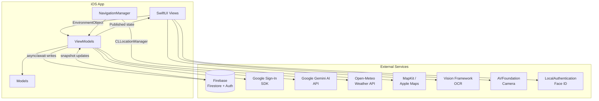
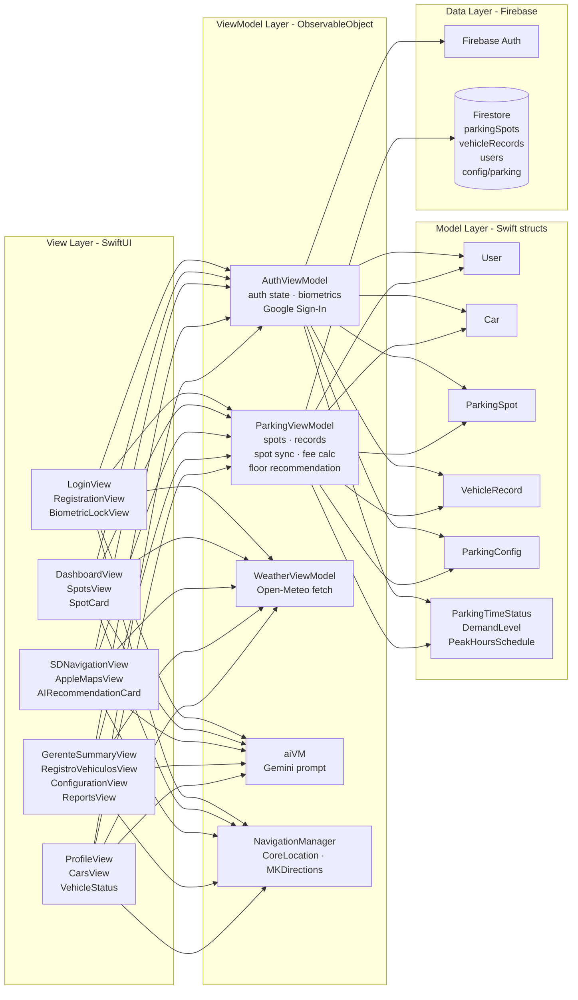
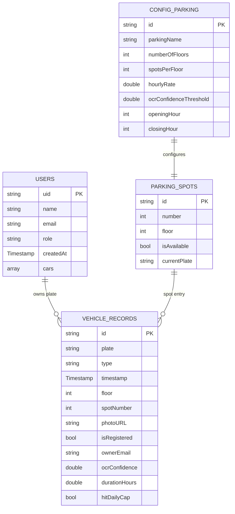
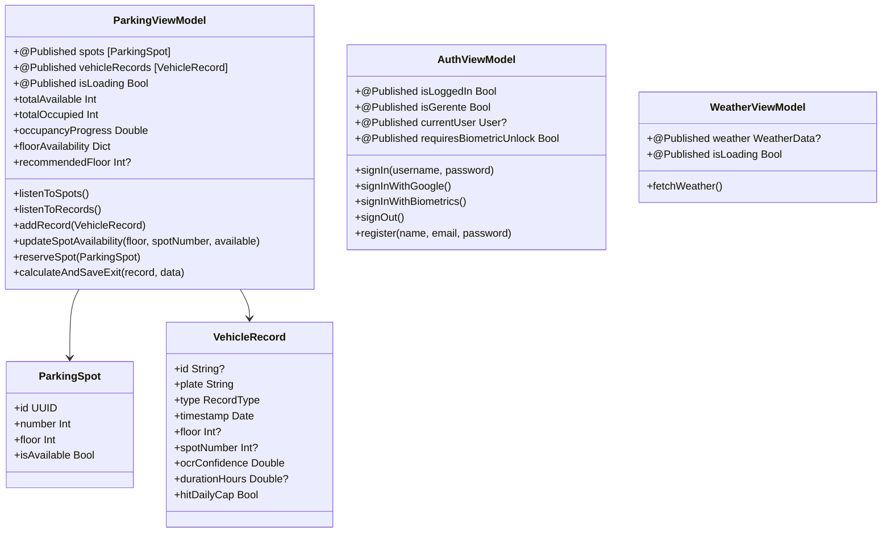
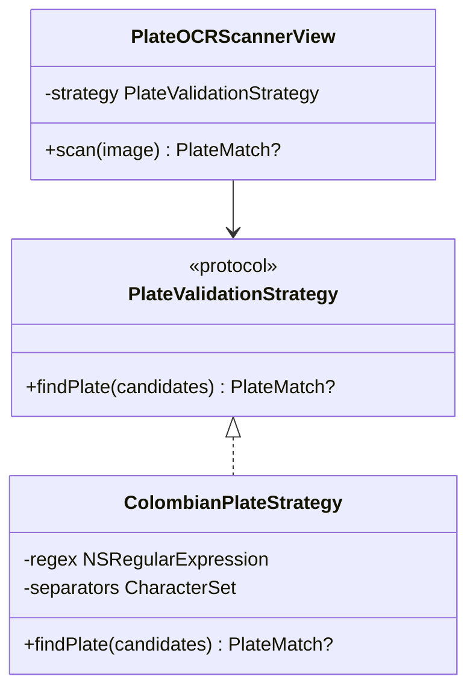
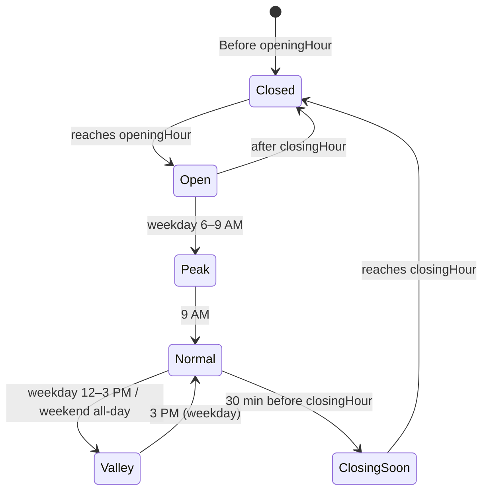
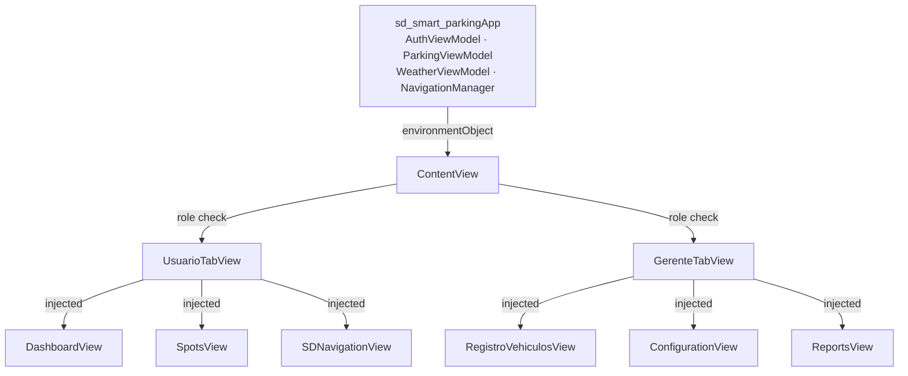
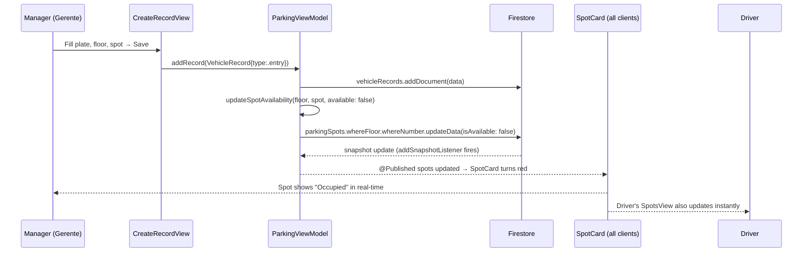
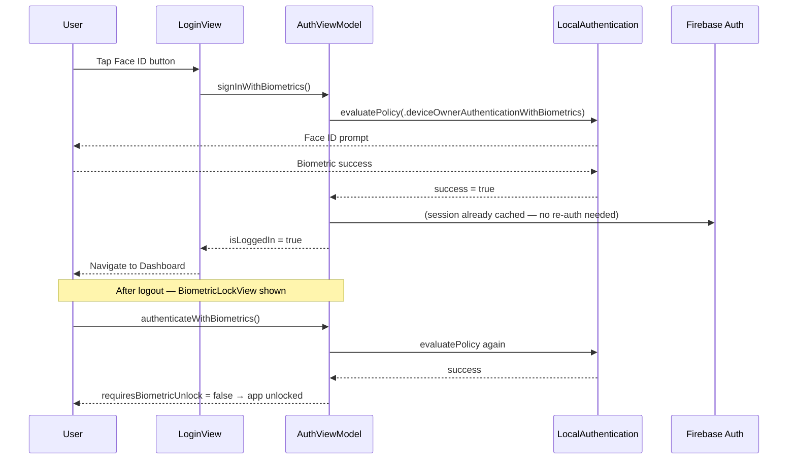
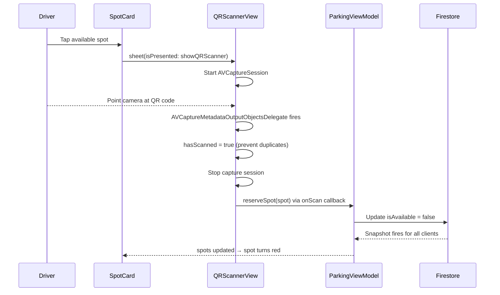

# SD Smart Parking — Architecture & Design Wiki

> **Platform:** iOS (SwiftUI) · **Backend:** Firebase (Firestore + Auth) · **Sprint 2**  
> **Team:** Juan Esteban Jiménez (Juanes) · Mateo Rincón · Diego Benavides

---

## Table of Contents

1. [Team Contributions](#1-team-contributions)
2. [High-Level Architecture](#2-high-level-architecture)
3. [Layered Architecture Diagram](#3-layered-architecture-diagram)
4. [Data Architecture — Firestore Schema](#4-data-architecture--firestore-schema)
5. [Design Patterns & Tactics](#5-design-patterns--tactics)
   - [MVVM](#51-model-view-viewmodel-mvvm)
   - [Observer / Repository Pattern](#52-observer--repository-pattern)
   - [Strategy Pattern — OCR Plate Validation](#53-strategy-pattern--ocr-plate-validation)
   - [Context-Aware Tactic — Time-Aware Demand](#54-context-aware-tactic--time-aware-demand)
   - [Dependency Injection via EnvironmentObject](#55-dependency-injection-via-environmentobject)
6. [Feature Interaction Flow Diagrams](#6-feature-interaction-flow-diagrams)
7. [Juanes — Business Questions Answered](#7-juanes--business-questions-answered)
8. [Viva Voce Requirements (Juanes)](#8-viva-voce-requirements-juanes)
9. [Diego — Business Questions Answered](#9-diego--business-questions-answered)
10. [Viva Voce Requirements (Diego)](#10-viva-voce-requirements-diego)
11. [Mateo — Business Questions Answered](#11-mateo--business-questions-answered)
12. [Viva Voce Requirements (Mateo)](#12-viva-voce-requirements-mateo)

---

## 1. Team Contributions

### Juan Esteban Jiménez — `JuanesJB`

| PR | Feature | Files |
|---|---|---|
| [#8](../../pull/8) | **Face ID / Biometric Authentication** — Always-visible Face ID button; `signInWithBiometrics()` via `LAContext`; `BiometricLockView` after soft logout to prevent session takeover | `AuthViewModel.swift`, `BiometricLockView.swift`, `LoginView.swift` |
| [#8](../../pull/8) | **QR Code Scanner for Spot Confirmation** — `AVCaptureSession` with `.qr` metadata detection; single-scan guard; camera permission request at runtime | `QRScannerView.swift`, `SpotCard.swift` |
| [#8](../../pull/8) | **Logout Race-Condition Fix** — `@MainActor signOut()` resets all published state atomically; prevents Firebase auth listener from overwriting `requiresBiometricUnlock` | `AuthViewModel.swift` |
| [#16](../../pull/16) | **Real-Time Spot Sync** — `updateSpotAvailability(floor:spotNumber:available:)` in `ParkingViewModel`; entry records flip spot to occupied, exit records release it; both roles see changes via existing snapshot listener | `ParkingViewModel.swift` |
| [#16](../../pull/16) | **Admin Spot Card Controls** — Manager can tap any spot (occupied or free) to toggle it directly via `reserveSpot`; driver sees "Scan QR" instead | `SpotCard.swift` |
| [#16](../../pull/16) | **Weather Overlay** — `WeatherViewModel` fetches live data from Open-Meteo API (no API key); frosted-glass pill with SF Symbol + temperature rendered in the navigation map top-left | `WeatherViewModel.swift`, `SDNavigationView.swift` |
| [#13](../../pull/13) | **Release 1.0.0** — Tagged and merged release branch; consolidated all Sprint 1 features into main | — |

---

### Mateo Rincón — `mateo-rincon`

| PR | Feature | Files |
|---|---|---|
| [#5](../../pull/5) | **Initial Xcode project setup** | Project scaffold |
| [#6](../../pull/6) | **Firebase backend integration** — Email/Password auth, Firestore bootstrap, initial manager and user screens | `AuthViewModel.swift`, `ParkingViewModel.swift`, Manager views, User views |
| [#6](../../pull/6) | **Turn-by-turn Navigation** — `NavigationManager` with `CLLocationManager` + `MKDirections`; ETA & distance to SD Building | `NavigationManager.swift`, `SDNavigationView.swift`, `AppleMapsView.swift`, `GoogleMapsView.swift` |
| [#6](../../pull/6) | **Manager Screens** — `ConfigurationView`, `RegistroVehiculosView`, `ReportsView` (Charts), `GerenteSummaryView`, `CreateRecordView`, `RecordDetailView` | Gerente views |
| [#6](../../pull/6) | **User Dashboard** — Live occupancy metrics, collapsible/static header, scroll offset coordination | `DashboardView.swift`, `StaticHeader.swift`, `CollapsibleHeader.swift` |
| [#14](../../pull/14) | **Live Vehicle Status Card** — Firestore compound queries with generated indexes; real-time card in profile showing floor, spot, duration, and accrued fee | `VehicleStatus.swift`, `ParkingViewModel.listenToUserCars()` |
| [#14](../../pull/14) | **Entry/Exit Bug Fixes** — Validated last record type before allowing exit; fixed duplicate exit bug; delete records with swipe | `ParkingViewModel.swift`, `RegistroVehiculosView.swift` |
| [#15](../../pull/15) | **Location Permissions** — Added `NSLocationWhenInUseUsageDescription` to `Info.plist` for CoreLocation runtime prompt | `Info.plist` |
| [#17](../../pull/17) | **AI Gemini Recommendations** — `aiVM` calls Google Gemini 2.5 Flash Lite with dynamic parking context; `AIRecommendationCard` surfaces 2-sentence Spanish tip on navigation screen | `aiVM.swift`, `AIRecomendationCard.swift` |

---

### Diego Benavides — `db-unicode`

| PR | Feature | Files |
|---|---|---|
| [#1](../../pull/1)–[#3](../../pull/3) | **Project hygiene** — PR template, contributing guide, CodeRabbit CI config | `.github/`, `.coderabbit.yml` |
| [#7](../../pull/7) | **Role-based tab navigation** — `GerenteTabView` (5 tabs) and `UsuarioTabView` (4 tabs) with scroll-offset coordination | `GerenteTabView.swift`, `UsuarioTabView.swift`, `ScrollOffsetKey.swift` |
| [#7](../../pull/7) | **Profile management** — `ProfileView`, `EditProfileView` (update name/email), `CarsView` (add/list vehicles) | Profile views |
| [#7](../../pull/7) | **Parking Config** — `ParkingConfig` (`ObservableObject`) syncs floors, spots, rates, hours, and OCR threshold with Firestore | `ParkingConfig.swift` |
| [#7](../../pull/7) | **`SmallCard` component** — Reusable metric card with icon, title, subtitle | `SmallCard.swift` |
| [#18](../../pull/18) | **Best Floor Recommendation** — `floorAvailability` and `recommendedFloor` computed properties; banner at top of `SpotsView`; `FloorBadge` component; suppresses tie within 2 spots | `ParkingViewModel.swift`, `SpotsView.swift`, `FloorBadge.swift` |
| [#18](../../pull/18) | **Unit test suite** — 12 tests for floor recommendation logic | `ParkingViewModelTests.swift` |
| [#19](../../pull/19) | **Time-aware demand banners** — `PeakHoursSchedule` classifies demand (peak/valley/normal); `ParkingStatusBannerView` with color-coded urgency; `ParkingClosedCardView`; `TimelineView` live countdown | `ParkingTimeStatus.swift`, `ParkingStatusBannerView.swift`, `ParkingClosedCardView.swift`, `DashboardView.swift` |
| [#19](../../pull/19) | **35 unit tests** for time status logic | `ParkingTimeStatusTests.swift` |
| [#20](../../pull/20) | **License Plate OCR Scanner** — `PlateValidationStrategy` protocol + `ColombianPlateStrategy`; `VNRecognizeTextRequest` with `.accurate` level; auto-fills plate + confidence in create-record form | `ColombianPlateValidator.swift`, `PlateOCRScannerView.swift`, `CreateRecordView.swift` |
| [#20](../../pull/20) | **18 unit tests** for plate validator | `ColombianPlateValidatorTests.swift` |

---

## 2. High-Level Architecture



**Why this technology stack:**

- **SwiftUI** was chosen over UIKit because its declarative, reactive binding model (`@Published` → view re-render) maps directly onto real-time data from Firestore. A change to a spot's `isAvailable` field propagates to every screen automatically — no manual `tableView.reloadData()` or delegate callbacks needed.
- **Firebase Firestore** over a custom REST backend: Firestore provides real-time snapshot listeners out of the box, eliminating the need to build a WebSocket server. For a parking app where spot state changes frequently and multiple users need the same view, this was the fastest path to a consistent, live shared state.
- **Firebase Auth** over rolling a custom auth system: it handles token refresh, session persistence, and third-party OAuth (Google) in a few lines. Combining it with `LocalAuthentication` (Face ID) gave us two-factor-style UX without additional infrastructure.
- **Open-Meteo** over OpenWeatherMap or similar: it is completely free with no API key, removing the need to manage secrets in the client. For a university project with fixed coordinates, its accuracy is more than sufficient.
- **Google Gemini AI** over a rule-based recommendation system: a rule-based system would require us to manually define every edge case (rain + full lot + peak hour). Gemini understands all three simultaneously from a single natural-language prompt, and can reason about traffic patterns it learned during training.
- **MapKit + CoreLocation** over Google Maps SDK: MapKit is native, free, requires no API key, and integrates with `MKDirections` for routing without external dependencies.
- **Vision framework** over a third-party OCR SDK: Vision runs fully on-device with no network call, no latency, and no licensing cost. For a Colombian plate format (`ABC123`) with a simple regex, on-device ML inference is more than accurate enough.

---

## 3. Layered Architecture Diagram



---

## 4. Data Architecture — Firestore Schema



**Spot numbering convention:** `floor × 100 + spotIndex` (e.g., Floor 1, spot 3 → `103`). Queries filter by both `floor` and `number` fields to locate the exact document.

---

## 5. Design Patterns & Tactics

### 5.1 Model-View-ViewModel (MVVM)

> **Authors:** Mateo (foundation — `ParkingViewModel`, `AuthViewModel`, PR #6) · Juanes (auth extensions, spot sync — PR #8, #16) · Diego (floor recommendation, tab navigation, parking config — PR #7, #18)

MVVM is the foundational architecture. Each ViewModel is an `ObservableObject` with `@Published` properties that drive the UI reactively. Views never access Firestore directly.

**Why MVVM and not MVC or VIPER:** SwiftUI was designed around MVVM — its property wrappers (`@Published`, `@StateObject`, `@EnvironmentObject`) are first-class implementations of the ViewModel binding contract. MVC in SwiftUI collapses into Massive-View-Controller because there is no `UIViewController` to hold business logic; the View itself becomes bloated. VIPER adds three extra layers (Interactor, Presenter, Router) that are overkill for a three-screen parking app. MVVM gives us a clean separation — Views declare what to show, ViewModels decide what data to expose — without over-engineering.



**Views subscribe via `@EnvironmentObject`** — no direct ViewModel construction inside views:

```swift
// ContentView.swift — injecting ViewModels at root — Mateo (PR #6), extended by Juanes + Diego
@StateObject private var authVM = AuthViewModel()
@StateObject private var parkingVM = ParkingViewModel()
@StateObject private var weatherVM = WeatherViewModel()

var body: some View {
    ContentView()
        .environmentObject(authVM)
        .environmentObject(parkingVM)
        .environmentObject(weatherVM)
}
```

---

### 5.2 Observer / Repository Pattern

> **Authors:** Mateo (listener setup, `listenToSpots`, `listenToRecords` — PR #6) · Juanes (`updateSpotAvailability` write-path — PR #16)

`ParkingViewModel` acts as a **Repository** — it is the single source of truth for parking data. It abstracts all Firestore operations behind clean Swift APIs, and uses Firestore's `addSnapshotListener` (the **Observer** pattern) to push live updates to all subscribed views without polling.

```swift
// ParkingViewModel.swift — real-time listener (Observer pattern) — Mateo, PR #6
func listenToSpots() {
    spotsListener = db.collection("parkingSpots")
        .order(by: "floor")
        .addSnapshotListener { [weak self] snapshot, error in
            guard let self, let docs = snapshot?.documents else { return }
            self.spots = docs.compactMap { doc in
                let data = doc.data()
                guard let number = data["number"] as? Int,
                      let floor  = data["floor"]  as? Int else { return nil }
                return ParkingSpot(
                    id: UUID(uuidString: doc.documentID) ?? UUID(),
                    number: number,
                    floor: floor,
                    isAvailable: data["isAvailable"] as? Bool ?? true
                )
            }
        }
}
```

**Spot sync write-path** — entry/exit records trigger spot state mutations atomically:

```swift
// ParkingViewModel.swift — spot sync on entry/exit (Repository write) — Juanes, PR #16
func updateSpotAvailability(floor: Int, spotNumber: Int, available: Bool) async {
    let targetNumber = (floor * 100) + spotNumber
    let snapshot = try? await db.collection("parkingSpots")
        .whereField("floor", isEqualTo: floor)
        .whereField("number", isEqualTo: targetNumber)
        .getDocuments()
    guard let ref = snapshot?.documents.first?.reference else { return }
    try? await ref.updateData(["isAvailable": available])
}
```

**Why Observer + Repository and not direct Firestore calls from views:** Two reasons. First, if views called Firestore directly, every view would need its own listener — meaning three open connections for the same `parkingSpots` collection when the driver has three tabs open simultaneously. Centralising in `ParkingViewModel` means one listener feeds all views. Second, the Repository boundary is a correctness guarantee: entry/exit logic, fee calculation, and spot sync all need to happen together atomically. If a view called `db.collection("vehicleRecords").addDocument(...)` directly, it would bypass the `updateSpotAvailability` call that keeps spot state consistent. Funnelling all writes through `ParkingViewModel` makes it impossible to create a record without syncing the spot.

---

### 5.3 Strategy Pattern — OCR Plate Validation

> **Author:** Diego (PR #20)

License plate OCR uses the **Strategy** pattern, making the recognition algorithm swappable without changing the call site. `PlateValidationStrategy` is the protocol; `ColombianPlateStrategy` is the concrete strategy for the local `[A-Z]{3}[0-9]{3}` format.

```swift
// ColombianPlateValidator.swift — Diego, PR #20
protocol PlateValidationStrategy {
    func findPlate(in candidates: [(text: String, confidence: Float)]) -> PlateMatch?
}

struct ColombianPlateStrategy: PlateValidationStrategy {
    private static let regex = try! NSRegularExpression(pattern: "^[A-Z]{3}[0-9]{3}$")

    // Strips separators Vision misreads as dots/dashes on real plates
    private static let separators = CharacterSet(charactersIn: ".-·•–—")
        .union(.whitespaces).union(.punctuationCharacters)

    func findPlate(in candidates: [(text: String, confidence: Float)]) -> PlateMatch? {
        for candidate in candidates {
            let stripped = candidate.text
                .uppercased()
                .components(separatedBy: ColombianPlateStrategy.separators)
                .joined()
            let range = NSRange(stripped.startIndex..., in: stripped)
            if ColombianPlateStrategy.regex.firstMatch(in: stripped, range: range) != nil {
                return PlateMatch(plate: stripped, confidence: candidate.confidence)
            }
        }
        return nil
    }
}
```



**Why Strategy and not a simple `if/switch` inside the scanner:** A `switch` on plate format would couple the OCR scanner directly to the Colombian format — adding a second format (e.g., a new alphanumeric scheme after a regulation change) would require editing the scanner, the validator, and the tests together. The Strategy protocol decouples the *how to validate* from the *where to validate*, so a new `InternationalPlateStrategy` can be dropped in without touching `PlateOCRScannerView` or `CreateRecordView`. The confidence score threading through `PlateMatch` was a deliberate design: OCR accuracy varies by lighting and camera quality, so the manager needs to be able to set a threshold (`ocrConfidenceThreshold` in Firestore config) below which a human must verify the plate — this is impossible if the confidence value is discarded inside the switch.

---

### 5.4 Context-Aware Tactic — Time-Aware Demand

> **Authors:** Diego (`PeakHoursSchedule`, demand banners — PR #19) · Juanes (weather overlay — PR #16)

`PeakHoursSchedule` implements a **context-aware** behavioral tactic: the app reads the device clock and day-of-week to classify the current moment into a demand level, then adapts the dashboard UI accordingly.

```swift
// ParkingTimeStatus.swift — demand classification — Diego, PR #19
static func demandLevel(at date: Date) -> DemandLevel {
    let hour = Calendar.current.component(.hour, from: date)
    let weekend = isWeekend(at: date)

    let peaks   = weekend ? weekendPeakRanges   : weekdayPeakRanges    // [] on weekends
    let valleys = weekend ? weekendValleyRanges  : weekdayValleyRanges  // all-day on weekends

    for range in peaks   { if hour >= range.start && hour < range.end { return .peak   } }
    for range in valleys { if hour >= range.start && hour < range.end { return .valley } }
    return .normal
}
```

The dashboard uses `TimelineView(.periodic(from: Date(), by: 60))` to re-evaluate demand every minute — no manual refresh needed:

```swift
// DashboardView.swift — live demand banner — Diego, PR #19
TimelineView(.periodic(from: Date(), by: 60)) { context in
    let status = PeakHoursSchedule.operatingStatus(
        at: context.date, openingHour: config.openingHour, closingHour: config.closingHour
    )
    ParkingStatusBannerView(
        demandLevel: PeakHoursSchedule.demandLevel(at: context.date),
        countdown: PeakHoursSchedule.transitionCountdown(at: context.date, ...)
    )
}
```



**Why time-aware context and not just show raw occupancy numbers:** Raw numbers alone ("12 spots free") do not tell a user whether that number will get worse or better in the next 30 minutes. By classifying the current moment into peak/valley/normal and showing a countdown to the next transition, the app gives users *actionable* information — "leave now, valley hours start in 20 minutes" — rather than a static snapshot. The `TimelineView` re-evaluation every 60 seconds was chosen over a `Timer` because `TimelineView` is lifecycle-aware: it automatically pauses when the app is backgrounded and resumes correctly, avoiding unnecessary computation. A `Timer` would keep firing in the background and could show a stale banner when the app returns to foreground.

**Why hardcode weekday/weekend schedules instead of pulling from Firestore:** The demand schedule is tied to the university calendar, which changes rarely (only when policy changes). Pulling it from Firestore on every app launch adds a network round trip and a failure mode (what if the fetch fails?). Hardcoding it locally with a clear `// TODO: Replace with Firestore` comment gives a working baseline that is fast, offline-capable, and easy to migrate later.

**Weather as additional context:** `WeatherViewModel` fetches the current weather at the SD Building's fixed coordinates (lat 4.6014, lng -74.0649) and overlays a frosted-glass pill on the navigation map. This gives en-route users context (rain → expect delays) before they decide to drive.

```swift
// WeatherViewModel.swift — external context fetch — Juanes, PR #16
func fetchWeather() async {
    let urlString = "https://api.open-meteo.com/v1/forecast?" +
        "latitude=\(latitude)&longitude=\(longitude)" +
        "&current=temperature_2m,weather_code"
    guard let url = URL(string: urlString) else { return }
    let (data, _) = try await URLSession.shared.data(from: url)
    // parse temperature_2m + weather_code → WeatherData struct
}
```

---

### 5.5 Dependency Injection via EnvironmentObject

> **Authors:** Mateo (initial app entry point — PR #6) · Diego (tab structure — PR #7) · Juanes (auth + weather VMs — PR #8, #16)

All ViewModels are created once at the app root and injected downward. No View creates its own ViewModel instance (except leaf sheets that own ephemeral state). This avoids duplicated Firestore listeners and ensures all views share the same live data.

**Why `@EnvironmentObject` over passing ViewModels through `init` parameters:** In a tab-based app with 4–5 levels of view nesting, init-based injection creates "prop drilling" — every intermediate view must accept and forward a ViewModel it doesn't use, just to pass it to a child. `@EnvironmentObject` eliminates this: a `ParkingViewModel` injected at the root is directly accessible in a deeply nested `SpotCard` without any intermediate view knowing about it. The trade-off is that forgetting to inject a required object causes a runtime crash rather than a compile-time error — we accepted this trade-off because all injections happen in one place (`sd_smart_parkingApp.swift`) and are immediately obvious.



---

## 6. Feature Interaction Flow Diagrams

### Entry Record + Spot Sync Flow
> **Authors:** Mateo (`CreateRecordView`, `addRecord` — PR #6) · Juanes (`updateSpotAvailability`, admin toggle — PR #16)

**Why this flow and not updating the spot directly from the UI:** The entry record and spot state update are two separate Firestore writes that must stay in sync. If the spot was updated from the view directly (before the record was saved), a crash between the two writes would leave the spot marked occupied with no record explaining why. By routing everything through `ParkingViewModel.addRecord()`, the ViewModel controls the write order: record first, then spot update. If the spot update fails, the record still exists as evidence and the admin can manually correct the spot — no silent data corruption.



### Biometric Authentication Flow
> **Author:** Juanes (PR #8)

**Why biometrics on top of Firebase Auth and not instead of it:** Firebase Auth manages the session token and role (driver/manager) stored in Firestore. Face ID alone cannot establish a new session — it can only unlock an existing one. The design treats Firebase as the *identity provider* and Face ID as the *re-authentication gate*: after a soft logout, the Firebase session is still cached, but the app blocks access behind `BiometricLockView`. This means the user never has to type their password again on a trusted device, while the server-side session can still be revoked remotely if needed. A hard logout (clearing the Firebase session) shows the normal email/password screen, giving users the option to switch accounts.



### QR Spot Scanner Flow
> **Author:** Juanes (PR #8)

**Why QR codes to confirm a spot and not just a tap:** A tap on a spot card from anywhere in the app would let a driver claim a spot without being physically present. The QR code printed at each physical spot creates a proof-of-presence requirement — the driver must be at the spot to scan it. The `hasScanned` flag prevents the scanner from firing multiple times if the camera detects the same code in successive frames, which would trigger multiple `reserveSpot` calls and potentially corrupt the spot state.



---

## 7. Juanes — Business Questions Answered

### BQ-13 · Real-Time Accuracy of Spot Counts and Queue Estimates **Primary**

> *"Are the displayed available spot counts and queue estimates accurate in real-time?"*

**How:** PR #16 implemented `updateSpotAvailability()` to write spot state back to Firestore whenever an entry or exit record is saved. Combined with the existing `addSnapshotListener` in `ParkingViewModel.listenToSpots()`, every client (manager and driver) sees spot state changes within milliseconds of a record being created — no manual refresh, no polling.

The `SpotCard` UI reflects `isAvailable` directly from the live `spots` array:

```swift
// SpotCard.swift — reflects live Firestore state — Juanes, PR #16
Circle()
    .fill(spot.isAvailable ? Color.green.opacity(0.1) : Color.red.opacity(0.1))
Image(systemName: "car.fill")
    .foregroundColor(spot.isAvailable ? .green : .red)
Text(spot.isAvailable ? "Available" : "Occupied")
```

The manager's admin tap-to-toggle (`reserveSpot`) also writes through the same path, so manual corrections propagate instantly.

---

### BQ-3 · Probability of Finding a Spot Within 10 Minutes **Supporting**

> *"What is the probability that a user arriving at the SD building will find an available parking spot within 10 minutes?"*

**How:** The spot sync (PR #16) keeps `totalAvailable` and `occupancyProgress` accurate in real-time. The driver's dashboard and spots view display these figures before the user leaves. The `recommendedFloor` computed property (Diego, PR #18 — built on `ParkingViewModel` properties established with the spot sync architecture) further guides users to the floor with the most availability, reducing search time.

```swift
// ParkingViewModel.swift — live availability for BQ-3 — Mateo (PR #6), Juanes extended (PR #16)
var totalAvailable: Int { spots.filter { $0.isAvailable }.count }
var occupancyProgress: Double {
    guard !spots.isEmpty else { return 0 }
    return Double(totalOccupied) / Double(spots.count)
}
```

---

### BQ-6 · Distance Threshold for Dynamic Queue Alerts **Supporting**

> *"At what distance should dynamic queue alerts notify en-route users about congestion changes?"*

**How:** The weather overlay (PR #16) surfaces current conditions on the navigation map. Weather (rain, fog, storm) is a leading indicator of congestion. `NavigationManager` continuously tracks the user's GPS position (throttled to >50 m movement to avoid noise) and computes live ETA/distance to the SD Building — the same location used by `WeatherViewModel`. Together they give en-route users two signals (road conditions + weather) to make a desist decision.

```swift
// NavigationManager.swift — context-aware distance tracking — Mateo, PR #6
func locationManager(_ manager: CLLocationManager, didUpdateLocations locations: [CLLocation]) {
    guard let location = locations.last else { return }
    guard location.horizontalAccuracy < 50,
          location.timestamp.timeIntervalSinceNow > -10 else { return }
    userLocation = location
    calculateRoute(from: location)   // recalculates only if moved >50 m
}
```

---

## 8. Viva Voce Requirements (Juanes)

### a) Sensor Feature — Camera (AVFoundation)

**QR Code Scanner** — PR #8

The `QRScannerView` uses the device camera via `AVFoundation` to confirm a spot reservation. `AVCaptureSession` is configured with `AVCaptureMetadataOutput` targeting `.qr` barcodes. A `hasScanned` flag prevents duplicate scans in the same session.

```swift
// QRScannerView.swift — sensor: camera — Juanes, PR #8
let session = AVCaptureSession()
let metadataOutput = AVCaptureMetadataOutput()
metadataOutput.setMetadataObjectsDelegate(self, queue: .main)
metadataOutput.metadataObjectTypes = [.qr]
```

---

### b) Type 2 (User Experience) — BQ-13 Real-Time Spot Availability

**Spot Sync** — PR #16

Entry/exit records written to `vehicleRecords` trigger `updateSpotAvailability()`, which mutates `parkingSpots` in Firestore. The snapshot listener propagates the change to all connected views. Drivers see live spot counts directly answering "will I find a spot?" before driving to the building.

---

### c) Context-Aware — Weather Overlay on Navigation Map

**WeatherViewModel + SDNavigationView** — PR #16

The app fetches current weather specifically for the SD Building's GPS coordinates (lat 4.6014, lng -74.0649) — not the user's location — because the relevant context is *where they are going*, not where they are. The frosted-glass pill updates on every `SDNavigationView` appearance, giving the driver parking-location-specific conditions.

```swift
// WeatherViewModel.swift — location-specific context — Juanes, PR #16
private let latitude  = 4.6014  // SD Building, Bogotá
private let longitude = -74.0649
```

---

### d) Smart Feature — Admin Spot Card Toggle

**SpotCard role-based intelligence** — PR #16

The `SpotCard` component adapts its behavior based on the authenticated role. For managers, any tap on any spot (free or occupied) instantly toggles availability via `vm.reserveSpot(spot)`. For drivers, only available spots respond, and they open the QR scanner. This role-aware interaction is a smart UI adaptation that removes friction for the admin workflow.

**Why put role logic inside `SpotCard` and not in two separate components:** A single component that adapts based on `isGerente` keeps the spot grid layout identical for both roles — the same `LazyVGrid`, the same spot sizing, the same colours. If we had two separate spot card components, any visual change (corner radius, shadow, colour palette) would need to be made in both. The role-specific behaviour (toggle vs. QR sheet) is a single `if isGerente` branch, which is far cheaper to maintain than a duplicated component tree.

```swift
// SpotCard.swift — smart role-based behavior — Juanes, PR #16
.onTapGesture {
    if isGerente {
        withAnimation(.spring()) { vm.reserveSpot(spot) }  // direct toggle
    } else if spot.isAvailable {
        showQRScanner = true  // driver: must scan QR
    }
}
```

---

### e) Authentication — Face ID / Biometric Login

**AuthViewModel + BiometricLockView** — PR #8

The app implements biometric authentication via `LocalAuthentication.LAContext`. Face ID (or Touch ID on older devices) is detected at runtime via `biometricType`. Two flows are supported:
- **Login-screen Face ID:** `signInWithBiometrics()` authenticates without requiring password re-entry when a Firebase session is cached.
- **Post-logout lock:** `BiometricLockView` is shown after soft logout, requiring `authenticateWithBiometrics()` before re-entering the app — preventing session hijacking.

```swift
// AuthViewModel.swift — biometric auth — Juanes, PR #8
func signInWithBiometrics() {
    let context = LAContext()
    context.evaluatePolicy(
        .deviceOwnerAuthenticationWithBiometrics,
        localizedReason: "Sign in to SD Smart Parking"
    ) { [weak self] success, error in
        DispatchQueue.main.async {
            if success { self?.isLoggedIn = true }
        }
    }
}
```

---

### f) External Service — Open-Meteo Weather API

**WeatherViewModel** — PR #16

Open-Meteo is a free, no-API-key weather REST API. `WeatherViewModel` hits the `/v1/forecast` endpoint with the parking building's coordinates and parses `temperature_2m` + `weather_code` from the JSON response using `URLSession` with async/await. The WMO weather code is mapped to an SF Symbol and color in the `WeatherData` struct using a `switch` on the code range.

```swift
// WeatherViewModel.swift — external service integration — Juanes, PR #16
let urlString = "https://api.open-meteo.com/v1/forecast?" +
    "latitude=\(latitude)&longitude=\(longitude)" +
    "&current=temperature_2m,weather_code"
let (data, _) = try await URLSession.shared.data(from: url)
// WeatherData.symbolName maps WMO codes to SF Symbols:
// 0-1 → sun.max.fill, 61-65 → cloud.rain.fill, 95-99 → cloud.bolt.rain.fill ...
```

---

## 9. Diego — Business Questions Answered

### BQ-4 · Optimal Departure Window 7–9 AM **Primary**

> *"What is the optimal departure window that maximizes a user's success of parking between 7–9 AM?"*

**How:** PR #19 implemented `PeakHoursSchedule` with weekday peak hours defined as 6–9 AM. The dashboard banner turns orange during this window and shows a live countdown to when normal hours resume — directly signalling to users that 7–9 AM is the worst window to arrive. The `DemandLevel` enum makes the classification explicit in code.

```swift
// ParkingTimeStatus.swift — peak hour classification answers BQ-4 — Diego, PR #19
static let weekdayPeakRanges: [(start: Int, end: Int)] = [(6, 9)]

// A driver seeing an orange "Horas Pico" banner at 7 AM gets an immediate signal:
// leave later (after 9 AM) or earlier (before 6 AM) for a higher success rate.
static func demandLevel(at date: Date) -> DemandLevel {
    let hour = Calendar.current.component(.hour, from: date)
    for range in weekdayPeakRanges {
        if hour >= range.start && hour < range.end { return .peak }
    }
    // ...
}
```

The `transitionCountdown` function tells the user exactly how many minutes remain until the peak window ends (e.g., "1h 45m para horario normal"), supporting a data-driven departure decision.

---

### BQ-3 · Probability of Finding a Spot Within 10 Minutes **Primary**

> *"What is the probability that a user arriving at the SD building will find an available parking spot within 10 minutes?"*

**How:** PR #18 added `recommendedFloor` — a computed property that identifies the floor with the most available spots (suppressing ties within 2 spots). A banner at the top of `SpotsView` shows drivers exactly where to go, eliminating floor-by-floor search time. `FloorBadge` inline labels ("Recommended" / "Last spots!") add urgency context at a glance.

```swift
// ParkingViewModel.swift — floor recommendation for BQ-3 — Diego, PR #18
var recommendedFloor: Int? {
    let sorted = floorAvailability.sorted { $0.value.available > $1.value.available }
    let best = sorted[0]
    guard best.value.available > 0 else { return nil }
    // Suppress tie: if second floor is within 2 spots, no clear winner
    if sorted.count >= 2 && best.value.available - sorted[1].value.available <= 2 {
        return nil
    }
    return best.key
}
```

A driver routed directly to the best floor has a significantly higher probability of securing a spot within the 10-minute window vs. searching blind.

**Why suppress the recommendation when floors are within 2 spots of each other:** If Floor 1 has 5 spots and Floor 2 has 4, the difference is negligible — routing the driver to Floor 1 provides no meaningful advantage and could actually be wrong (Floor 2 might be closer to the entrance). The tie-suppression threshold of 2 was chosen as the minimum gap where a recommendation becomes genuinely useful. Without this rule, the banner would fire even in statistically equivalent situations, eroding user trust in the recommendation over time.

---

### BQ-13 · Real-Time Accuracy **Supporting**

**How:** The best floor recommendation (PR #18) is derived entirely from the live `spots` array — the same array updated by Juanes's snapshot listener. Because `recommendedFloor` is a computed property (no caching), every Firestore snapshot update causes it to re-evaluate, keeping the recommendation accurate.

---

## 10. Viva Voce Requirements (Diego)

### a) Sensor Feature — Camera + Vision Framework (OCR)

**PlateOCRScannerView** — PR #20

`AVCapturePhotoOutput` captures a still image from the device camera. Apple's Vision framework processes it with `VNRecognizeTextRequest` at `.accurate` recognition level. Confidence scores from `VNRecognizedTextObservation` are extracted and passed through `PlateMatch` to gate the auto-fill vs. manual review flow.

```swift
// PlateOCRScannerView.swift — sensor: camera + Vision OCR — Diego, PR #20
let request = VNRecognizeTextRequest { request, error in
    let observations = request.results as? [VNRecognizedTextObservation] ?? []
    let candidates = observations.compactMap { obs -> (text: String, confidence: Float)? in
        guard let top = obs.topCandidates(1).first else { return nil }
        return (top.string, top.confidence)
    }
    // Pass to ColombianPlateStrategy for format validation
    if let match = findColombianPlate(in: candidates) {
        DispatchQueue.main.async { onPlateDetected(match) }
    }
}
request.recognitionLevel = .accurate
```

---

### b) Type 2 (User Experience) — BQ-4 Time-Aware Demand Banners

**ParkingStatusBannerView + DashboardView** — PR #19

The dashboard surface answers BQ-4 by making demand levels visible in real time. A `TimelineView` re-evaluates every 60 seconds so the banner transitions automatically as the user watches (peak → normal → valley → closing soon). Color coding gives instant UX feedback without requiring the user to know what 7–9 AM means statistically.

```swift
// DashboardView.swift — TimelineView drives automatic banner updates — Diego, PR #19
TimelineView(.periodic(from: Date(), by: 60)) { context in
    ParkingStatusBannerView(
        demandLevel: PeakHoursSchedule.demandLevel(at: context.date),
        countdown: PeakHoursSchedule.transitionCountdown(
            at: context.date,
            openingHour: config.openingHour,
            closingHour: config.closingHour
        )
    )
}
```

---

### c) Context-Aware — Time + Day-of-Week Demand Classification

**PeakHoursSchedule** — PR #19

The app reads two context signals simultaneously — **time of day** and **day of week** — to classify demand. Weekends suppress all peak periods and treat the entire operating window as valley, reflecting real-world university parking patterns. The classification runs locally with no network call, so it works offline.

```swift
// ParkingTimeStatus.swift — dual context signals — Diego, PR #19
static let weekendValleyRanges: [(start: Int, end: Int)] = [(6, 22)] // all-day valley
static let weekdayPeakRanges:   [(start: Int, end: Int)] = [(6, 9)]  // morning rush

static func demandLevel(at date: Date) -> DemandLevel {
    let weekend = isWeekend(at: date)  // context signal 1: day-of-week
    let hour    = Calendar.current.component(.hour, from: date)  // context signal 2: time
    let peaks   = weekend ? weekendPeakRanges : weekdayPeakRanges
    let valleys = weekend ? weekendValleyRanges : weekdayValleyRanges
    // ...
}
```

---

### d) Smart Feature — Best Floor Recommendation

**SpotsView + FloorBadge + ParkingViewModel** — PR #18

The recommendation is *smart* because it avoids trivial suggestions: it suppresses output when floors are within 2 spots of each other (no meaningful advantage), when the best floor is full, or when there is only one floor. The per-floor `FloorBadge` component escalates to "Last spots!" when fewer than 3 remain — a contextual urgency signal.

```swift
// ParkingViewModel.swift — smart suppression logic — Diego, PR #18
guard best.value.available > 0 else { return nil }          // no spots → no recommendation
if sorted.count >= 2 {
    let second = sorted[1]
    if best.value.available - second.value.available <= 2 { // tie → suppress
        return nil
    }
}
return best.key
```

---

### e) Authentication — Role-Based Access Control

**GerenteTabView / UsuarioTabView** — PR #7

Diego implemented the role-based navigation layer that enforces access control at the UI level. `ContentView` switches entirely between `GerenteTabView` (5 tabs: summary, records, config, reports, profile) and `UsuarioTabView` (4 tabs: dashboard, spots, navigation, profile) based on `authVM.isGerente`. Manager-only controls (spot toggle, delete records, config edit) are unreachable to driver accounts by construction.

**Why swap entire tab structures instead of hiding individual buttons:** Hiding buttons conditionally inside shared screens would mean the driver-facing UI always carries the manager's business logic in memory, even if never shown. Swapping the entire tab view at the root means driver sessions never instantiate manager screens at all — no dead code paths, no risk of a conditional check failing and exposing a privileged action. It also makes the two user journeys completely independent and testable in isolation.

```swift
// ContentView.swift — role-gated navigation — Diego, PR #7
if authVM.isGerente {
    GerenteTabView()   // manager: full admin access
} else {
    UsuarioTabView()   // driver: read-only parking data
}
```

---

### f) External Service — Apple Vision Framework (OCR Engine)

**PlateOCRScannerView + ColombianPlateValidator** — PR #20

Apple's Vision framework (`VNRecognizeTextRequest`) is the external OCR engine. It runs on-device ML inference with no network dependency. The OCR confidence score (0.0–1.0) returned by Vision is stored in `VehicleRecord.ocrConfidence` and compared against the manager-configurable threshold (`ParkingConfig.ocrConfidenceThreshold`) to decide whether to auto-accept or flag a plate for manual review.

---

## 11. Mateo — Business Questions Answered

### BQ-5 · Queue Time Threshold for Desist Recommendation **Primary**

> *"At what queue time threshold (>15 min) should the app recommend users to desist from driving to the SD building?"*

**How:** `NavigationManager` (PR #6) computes live ETA to the SD Building via `MKDirections`. The AI Recommendation Card (PR #17) combines real-time occupancy data (`totalAvailable`, `totalOccupied`) with an implicit traffic model from Gemini to generate a desist recommendation when conditions are unfavorable. The prompt explicitly tells Gemini to warn when fewer than 5 spots remain — a proxy for the >15 min queue threshold.

```swift
// aiVM.swift — desist recommendation logic via Gemini prompt — Mateo, PR #17
let prompt = """
Actúa como un asistente inteligente de movilidad para la Universidad de los Andes en Bogotá.
Contexto actual del parqueadero Edificio SD:
- Cupos libres: \(free)
- Cupos ocupados: \(occupied)
- Capacidad total: \(total)

Instrucciones:
1. Si los cupos libres son menos de 5, advierte seriamente sobre la alta ocupación.
2. Si hay más de 15 libres, menciona que el ingreso será fluido.
"""
```

---

### BQ-6 · Distance Threshold for Dynamic Queue Alerts **Primary**

> *"At what distance should dynamic queue alerts notify en-route users about congestion changes?"*

**How:** `NavigationManager` (PR #6) uses `CLLocationManager` with `kCLLocationAccuracyBest` and filters out stale or inaccurate readings (>50 m horizontal error, >10 s old). Route recalculation is throttled to fire only when the user has moved >50 m — a natural distance-based trigger. Live `distance` and `travelTime` strings are `@Published` and displayed in `ActiveNavigationView`, giving the user a continuous signal about their proximity to the building.

```swift
// NavigationManager.swift — distance-based route update throttle — Mateo, PR #6
private func calculateRoute(from location: CLLocation) {
    if let last = lastRouteCalculationLocation,
       location.distance(from: last) < 50 { return }  // 50 m threshold
    lastRouteCalculationLocation = location
    // trigger MKDirections recalculation → updates travelTime + distance
}
```

---

### BQ-4 · Optimal Departure Window 7–9 AM **Supporting**

**How:** `VehicleRecord` stores a `timestamp` for every entry and exit. Historical occupancy at any hour can be derived by querying `vehicleRecords` ordered by timestamp and grouping by hour — enabling an analysis of which departure window has the highest success rate. The fee field (`durationHours`) also records how long each vehicle stayed, supporting dwell-time analysis.

---

## 12. Viva Voce Requirements (Mateo)

### a) Sensor Feature — GPS / CoreLocation

**NavigationManager** — PR #6

`CLLocationManager` is configured with `kCLLocationAccuracyBest` and continuously streams GPS coordinates via `locationManager(_:didUpdateLocations:)`. The sensor data drives real-time route recalculation with `MKDirections`, live ETA display, and — combined with the fixed SD Building coordinates — live distance-to-destination computation.

**Why `kCLLocationAccuracyBest` with a 50 m movement threshold and not a time-based interval:** `kCLLocationAccuracyBest` ensures the route calculation uses the most accurate position available. However, recalculating a route on every GPS ping (which can fire several times per second in urban environments) would hammer the `MKDirections` API and drain battery. The 50 m movement threshold throttles recalculation to only fire when the user has actually moved a meaningful distance — balancing accuracy against power consumption. We also filter out readings older than 10 seconds or with horizontal accuracy worse than 50 m, which removes GPS glitches common in dense urban areas like Bogotá's university district.

```swift
// NavigationManager.swift — GPS sensor integration — Mateo, PR #6
let locationManager = CLLocationManager()
locationManager.desiredAccuracy = kCLLocationAccuracyBest
locationManager.requestWhenInUseAuthorization()
locationManager.startUpdatingLocation()

// Delegate fires on every GPS update
func locationManager(_ manager: CLLocationManager, didUpdateLocations locations: [CLLocation]) {
    guard let location = locations.last,
          location.horizontalAccuracy < 50,
          location.timestamp.timeIntervalSinceNow > -10 else { return }
    userLocation = location
    calculateRoute(from: location)
}
```

---

### b) Type 2 (User Experience) — BQ-5/BQ-6 Navigation ETA + AI Desist Advice

**NavigationManager + AIRecommendationCard** — PR #6, #17

The navigation tab gives users two real-time signals: live ETA/distance from `MKDirections` (answering BQ-6) and an on-demand AI recommendation that evaluates occupancy + inferred traffic (answering BQ-5). Together they let a user decide before committing to the drive whether it is worth going.

---

### c) Context-Aware — Route Adapts to Live User Location

**NavigationManager + ActiveNavigationView** — PR #6

The app does not use a static route. `MKDirections` is recalculated every time the user moves more than 50 m, so the route, ETA, and distance always reflect the user's actual current position. The `ActiveNavigationView` animates the map camera to follow the user, keeping the destination marker visible at all times.

```swift
// NavigationManager.swift — context-aware re-routing — Mateo, PR #6
private func calculateRoute(from location: CLLocation) {
    if let last = lastRouteCalculationLocation,
       location.distance(from: last) < 50 { return }
    lastRouteCalculationLocation = location
    let request = MKDirections.Request()
    request.source = MKMapItem(placemark: MKPlacemark(coordinate: location.coordinate))
    request.destination = MKMapItem(placemark: MKPlacemark(coordinate: destination))
    request.transportType = .automobile
    MKDirections(request: request).calculate { [weak self] response, _ in
        self?.route = response?.routes.first
        self?.travelTime = /* formatted ETA */
        self?.distance   = /* formatted km  */
    }
}
```

---

### d) Smart Feature — AI Gemini Recommendations

**AIViewModel + AIRecommendationCard** — PR #17

`AIViewModel` calls **Google Gemini 2.5 Flash Lite** with a dynamically-constructed prompt that injects live parking occupancy (`free`, `occupied`, `total`). Gemini reasons over this context plus its training knowledge of Bogotá traffic patterns to generate a 2-sentence, tone-appropriate Spanish recommendation. Safety settings for `harassment` and `dangerousContent` are relaxed to prevent false-positive blocking of traffic-related language.

**Why Gemini 2.5 Flash Lite and not a heavier model or a rule-based system:** Flash Lite is optimised for low latency and low cost — a critical constraint for a student project with API usage limits. A rule-based system (`if free < 5 then "parking is full"`) cannot account for the combination of occupancy, time of day, and Bogotá-specific traffic conditions simultaneously. Gemini can reason across all three in a single inference call, producing nuanced advice that a rule tree would require hundreds of branches to replicate. Safety settings for `dangerousContent` were relaxed because Gemini's default classifier incorrectly flags traffic and driving-related language as potentially dangerous — a false positive that would block the core use case.

```swift
// aiVM.swift — dynamic prompt with live parking context — Mateo, PR #17
func getAIRecommendation(free: Int, occupied: Int) {
    let total = free + occupied
    let prompt = """
    Actúa como un asistente inteligente de movilidad para la Universidad de los Andes en Bogotá.
    Contexto actual del parqueadero Edificio SD:
    - Cupos libres: \(free) / Cupos ocupados: \(occupied) / Capacidad total: \(total)
    Instrucciones: máximo 2 frases, tono amable pero profesional, sin saludos genéricos.
    """
    Task {
        let response = try await model.generateContent(prompt)
        aiResponse = response.text ?? "..."
    }
}
```

---

### e) Authentication — Email/Password + Google Sign-In

**AuthViewModel** — PR #6

Mateo built the foundational authentication layer integrating two providers: Firebase Email/Password and Google Sign-In (`GoogleSignInSwift` SDK). Google Sign-In exchanges a `GIDGoogleUser` ID token + access token for a Firebase `GoogleAuthProvider.credential`, unifying both flows under a single Firebase Auth session. The `Auth.auth().addStateDidChangeListener` pattern ensures the app always reflects the current auth state without manual polling.

**Why two auth providers instead of just one:** Universidad de los Andes students use Google accounts (`@uniandes.edu.co`) for everything. Offering Google Sign-In removes the friction of creating a new password — most target users will choose it over email/password. However, keeping email/password as a fallback ensures the app is not locked to Google's OAuth availability; if Google's servers are down, users can still authenticate. Unifying both under Firebase Auth means role management, Firestore rules, and session handling work identically regardless of which provider was used.

```swift
// AuthViewModel.swift — Google Sign-In → Firebase credential exchange — Mateo, PR #6
func signInWithGoogle() async {
    guard let clientID = FirebaseApp.app()?.options.clientID else { return }
    let config = GIDConfiguration(clientID: clientID)
    GIDSignIn.sharedInstance.configuration = config

    let result = try await GIDSignIn.sharedInstance.signIn(withPresenting: rootViewController)
    let idToken = result.user.idToken!.tokenString
    let credential = GoogleAuthProvider.credential(
        withIDToken: idToken,
        accessToken: result.user.accessToken.tokenString
    )
    try await Auth.auth().signIn(with: credential)
}
```

---

### f) External Service — Google Gemini AI API

**AIViewModel + AIRecommendationCard** — PR #17

Google Gemini 2.5 Flash Lite is invoked via the `GoogleGenerativeAI` Swift SDK. The API receives a natural-language prompt with live parking data and returns a contextual recommendation. This is a full round-trip to an external LLM inference service — the app has no local ML model for this feature. The `AIRecommendationCard` drives the call on a user-triggered button tap, with a `ProgressView` loading state while the network request is in flight.

```swift
// AIRecommendationCard.swift — external Gemini API call — Mateo, PR #17
self.model = GenerativeModel(
    name: "gemini-2.5-flash-lite",
    apiKey: "...",
    safetySettings: safetySettings
)

// On button tap — live data injected into prompt
let free     = parkingVM.totalAvailable
let occupied = parkingVM.totalOccupied
fetchAIRecommendation(free: free, occupied: occupied)
```

---

*Generated from commit history, PR descriptions, and live source code — April 2026*
