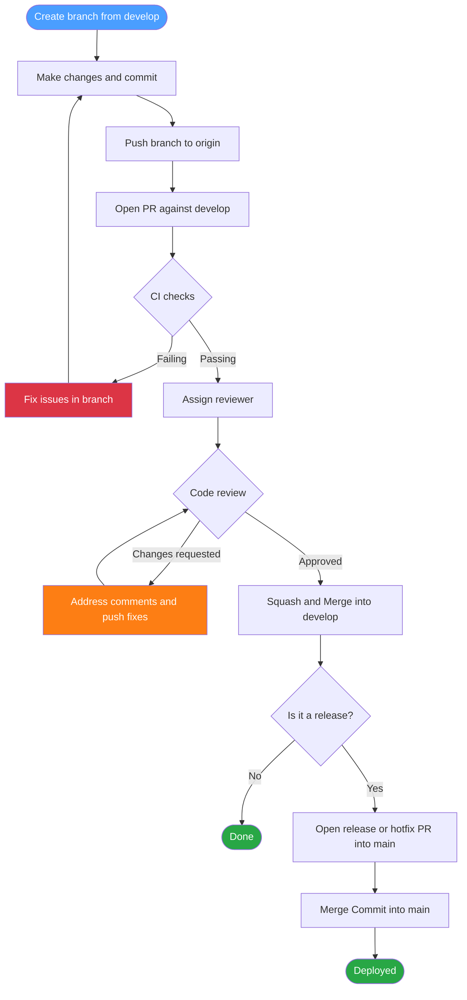

# Contributing Guide

Thank you for taking the time to contribute! This document outlines the standards and workflows we follow to keep the codebase clean, consistent, and maintainable.

---

## Table of Contents

- [Code of Conduct](#code-of-conduct)
- [Branch Naming](#branch-naming)
- [Commit Convention](#commit-convention)
- [Pull Request Process](#pull-request-process)
- [CI / GitHub Actions](#ci--github-actions)
- [Code Style](#code-style)

---

## Code of Conduct

This is a university project. Every team member is expected to **review pull requests** in a timely manner. Leaving PRs unreviewed blocks the team's progress and is not acceptable. Be constructive in your feedback and assume good intent.

---


## Branch Naming

Branches must follow this pattern:

```
<type>/<issue-number>-<short-description>
```

Use lowercase and hyphens — no spaces, no uppercase.

| Type | When to use |
|------|-------------|
| `feat/` | New feature |
| `fix/` | Bug fix |
| `hotfix/` | Critical fix that goes directly to main |
| `chore/` | Maintenance, configs, dependencies |
| `refactor/` | Code restructuring without behavior change |
| `docs/` | Documentation only |
| `ci/` | GitHub Actions and CI configuration |
| `test/` | Adding or updating tests |
| `release/` | Release preparation |

### Examples

```
feat/42-user-authentication
fix/87-token-expiration-bug
chore/12-add-pr-template
ci/30-add-worker-deploy-workflow
refactor/55-worker-auth-middleware
hotfix/99-cors-header-missing
release/v1.2.0
```

> **Rule:** Never commit directly to `main` or `develop`. Always open a PR.

---

## Commit Convention

We follow **Gitmoji + Conventional Commits**. Every commit must have a gitmoji, a type, an optional scope, and a short description.

### Format

```
<gitmoji> <type>(<scope>): <short description>

[optional body]

[optional footer: closes #issue]
```

### Rules

- Use the **imperative mood** in the description: `add feature` not `added feature`
- Keep the first line under **72 characters**
- Reference issues in the footer when applicable: `Closes #42`
- No period at the end of the description

### Gitmoji + Type Reference

| Gitmoji | Type | When to use |
|--------|------|-------------|
| ✨ | `feat` | Introduce a new feature |
| 🐛 | `fix` | Fix a bug |
| ♻️ | `refactor` | Restructure code without changing behavior |
| 📝 | `docs` | Add or update documentation |
| ✅ | `test` | Add or update tests |
| 👷 | `ci` | Add or update CI/CD configuration |
| 🔧 | `chore` | Maintenance tasks, configs, tooling |
| 🚀 | `perf` | Improve performance |
| 💄 | `style` | UI or code style changes (no logic) |
| 🔒️ | `fix` | Fix a security issue |
| 💥 | `feat!` | Introduce a breaking change |
| 🗑️ | `chore` | Remove deprecated code or files |
| 📦️ | `chore` | Update dependencies or packages |
| 🔥 | `chore` | Remove code or files |
| 🌐 | `feat` | Internationalization or localization |
| 🏗️ | `refactor` | Architectural changes |

### Scopes

Use the platform or module as the scope:

| Scope | Refers to |
|-------|-----------|
| `ios` | Swift / iOS app code |
| `android` | Kotlin / Android app code |
| `ui` | UI components or visual changes |
| `worker` | Cloudflare Workers backend |
| `api` | API contract or endpoints |
| `auth` | Authentication logic |
| `ci` | GitHub Actions workflows |
| `deps` | Dependencies |

### Examples

```bash
✨ feat(auth): add JWT refresh token logic
✨ feat(ios): add biometric authentication screen
✨ feat(android): add offline cache support
💄 style(ui): update button colors to match design system
🐛 fix(worker): resolve crash on empty request body
♻️ refactor(worker): extract auth middleware to separate module
👷 ci(worker): add deploy to staging on pull request
📦️ chore(deps): update wrangler to v3.22.0
💥 feat(api)!: rename /user endpoint to /profile
📝 docs: update setup instructions in README

# With body and footer
🐛 fix(worker): handle expired JWT tokens gracefully

Previously, expired tokens returned a 500 error.
Now returns a proper 401 with a descriptive message.

Closes #87
```

---

## Pull Request Process

### Workflow Diagram



### Before Opening a PR

- [ ] Your branch is up to date with `develop`
- [ ] CI checks pass locally (build succeeds, no warnings)
- [ ] The PR has a clear title following the commit convention
- [ ] The PR description is filled out using the template

### PR Title Format

Same as commit format:

```
✨ feat(auth): add JWT refresh token logic
🐛 fix(worker): handle rate limit on auth endpoint
```

### Review Process

1. Open your PR against `develop` (not `main`)
2. Assign at least **one reviewer**
3. Address all review comments before merging
4. PRs require **at least 1 approval** to merge
5. The author merges after approval — not the reviewer
6. Use **Squash and Merge** to keep the history clean

### Merge Strategy

| Target branch | Strategy |
|--------------|----------|
| `develop` | Squash and Merge |
| `main` | Merge Commit (from `release/` or `hotfix/` only) |

---

## CI / GitHub Actions

Tests and builds run automatically on every push and pull request. Do not merge a PR with failing checks.

| Workflow | Trigger | What it does |
|----------|---------|--------------|
| `worker.yml` | Push / PR | Lint, test and deploy to staging |

Check the **Actions** tab in GitHub for detailed logs on any failure.

> **Never hardcode secrets.** Use GitHub Actions secrets and reference them as environment variables. Never commit `.env` files or `wrangler.toml` secrets.

---

## Code Style

### Swift (iOS)

- Follow [Swift API Design Guidelines](https://swift.org/documentation/api-design-guidelines/)
- Use SwiftLint — configuration is in `.swiftlint.yml`
- Prefer `struct` over `class` unless reference semantics are needed
- Use `async/await` over completion handlers
- Prefer immutability: `let` over `var` whenever possible

### Kotlin (Android)

- Follow [Kotlin Coding Conventions](https://kotlinlang.org/docs/coding-conventions.html)
- Use ktlint — configuration is in `.editorconfig`
- Prefer immutability: `val` over `var`
- Use coroutines and `Flow` for async operations

### Cloudflare Workers (TypeScript)

- Follow the [Google TypeScript Style Guide](https://google.github.io/styleguide/tsguide.html)
- Use ESLint + Prettier — configuration is in `.eslintrc` and `.prettierrc`
- Keep Workers small and single-purpose
- Always validate and type incoming request bodies
- Never hardcode secrets — use `wrangler secret` or GitHub Actions secrets
