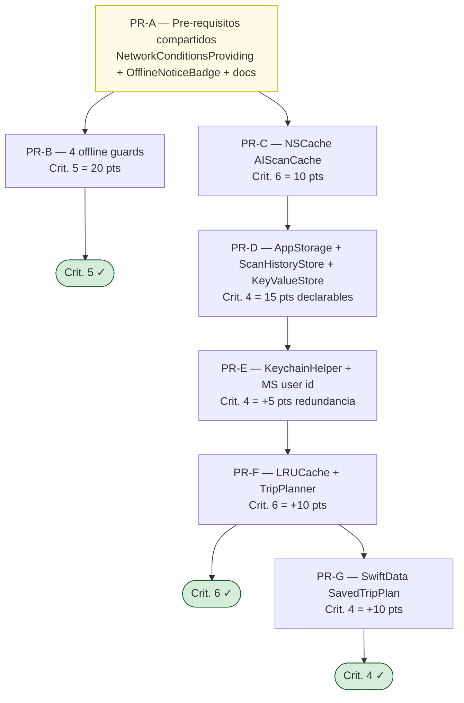

# Sprint 3 — Cobertura individual Diego

Estado actual y objetivo (autoría individual, sólo código atribuible a Diego en `git blame`):

| Criterio | Actual | Objetivo | Estrategia |
|---|---|---|---|
| 3. Multithreading / Async | 20 / 20 ✅ | 20 / 20 | Sólo defensa oral |
| 4. Local Storage | 0 / 20 | **20 / 20** (con cap) | SwiftData + Keychain + Codable file + @AppStorage + KeyValueStore |
| 5. Eventual Connectivity | 0 / 20 | **20 / 20** | 4 vistas Diego con guarda explícita NetworkMonitor |
| 6. Caching | 0 / 20 | **20 / 20** | NSCache propio (10) + LRU manual (10) |
| **Total** | **20 / 80** | **80 / 80** | 11 features ortogonales al código de Mateo/Juanes |

**Base del análisis:** [`docs/analysis/sprint-3-rubric-coverage.md`](../analysis/sprint-3-rubric-coverage.md) — trazabilidad línea-por-línea de qué tiene Diego hoy y qué falta.

## Documentos en esta carpeta

| Archivo | Para qué |
|---|---|
| [`diego-individual-coverage.md`](./diego-individual-coverage.md) | **Doc maestro.** 11 features con archivos exactos, decisiones técnicas, defensa oral. Único archivo necesario para ejecutar todo Sprint 3. |
| Esta `README.md` | Índice + roadmap |

> Optamos por la **versión consolidada** (un sólo doc maestro) en lugar de jerarquía 33-archivos por feature. Si una feature crece y demanda doc propio durante implementación, se promueve a `feat-{nombre}/plan.md` ahí mismo. Pragmático, evita escribir 33 plantillas vacías. Razones detalladas en plan: `~/.claude/plans/basado-en-docs-analysis-sprint-3-rubric-vivid-teacup.md` § R-1.

## Mapa de PRs (orden de ejecución)

Tras PR-B + PR-C ya estamos en **50 / 80**. Tras PR-G estamos en **80 / 80** con redundancia.

## Tabla de features

| # | Feature | PR | Pts | Estado |
|---|---|---|---|---|
| 0 | NetworkConditionsProviding + OfflineNoticeBadge | A | infra | 🟨 in-progress |
| 1 | Offline fallback en VehicleAI Scanner | B.1 | 5 (crit. 5) | 🟥 todo |
| 2 | Offline badge en Trip Planner | B.2 | 5 (crit. 5) | 🟥 todo |
| 3 | Last-synced en Demand Insights | B.3 | 5 (crit. 5) | 🟥 todo |
| 4 | Offline disable en botón Microsoft (Login) | B.4 | 5 (crit. 5) | 🟥 todo |
| 5 | NSCache `AIScanCache` para Gemini | C.1 | 10 (crit. 6) | 🟥 todo |
| 6 | `@AppStorage` con prefijo `diego.*` | D.1 | 5 (crit. 4) | 🟥 todo |
| 7 | `ScanHistoryStore` Codable + FileManager | D.2 | 5 (crit. 4) | 🟥 todo |
| 8 | `KeyValueStore<K,V>` hash-based + ScanStats | D.3 | 5 (crit. 4) | 🟥 todo |
| 9 | `KeychainHelper` + Microsoft user identifier | E.1 | 5 (crit. 4 redundancia) | 🟥 todo |
| 10 | `LRUCache<K,V>` doubly-linked list + TripPlanner | F.1 | 10 (crit. 6) | 🟥 todo |
| 11 | SwiftData `SavedTripPlan` + `TripHistoryView` | G.1 | 10 (crit. 4) | 🟥 todo |

**Total declarable:** 70 pts (excluyendo crit. 3 ya cubierto). Caps por criterio: 20 + 20 + 20 = 60 + crit. 3 (20) = 80 / 80.

## Reglas no-negociables

1. **Nunca tocar archivos de Mateo / Juanes.** Lista completa en `diego-individual-coverage.md` § "Archivos NO TOCAR".
2. **Llaves UserDefaults siempre con prefijo `diego.`** para que `git blame` no las confunda con `biometricsEnabled` (Juanes).
3. **Una feature = un PR.** Commits con `git add <archivo específico>`, NUNCA `git add .` en `Core/`, `FileManagers/`, `Repositories/`.
4. **Nunca** `Co-Authored-By: Claude` ni "Generated with Claude Code" en commits/PRs (CLAUDE.md).
5. **Branch naming:** `feat/sprint3-<letra>-<descripcion>` (ej. `feat/sprint3-d-keychain`).
6. Tras cada feature: `build_sim` verde + tests verdes antes de mergear.
